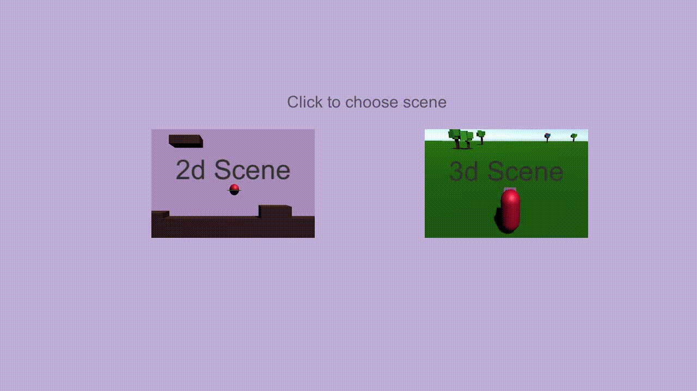

# camera playground

[Demo](Demo) - contains executable demo to try out [SmoothCamera.exe](Demo/SmoothCamera.exe)

Small project, containing 2 scenes with different showcases of camera and movement. 

 

### 2D scene

[code](SmoothCamera/Assets/Scripts/scene2D) - `CameraFollow2D` - `SimpleActorMovement`

Simple scene wityh environment created from cubes for orientation in space. You can move around with WSAD or arrow keys and rotate the world by Q/E. 
Sphere rotates and camera matches its rotation. Camera uses Lerp and Slerp to smoothly follow the sphere. Movement axises dont rotate with rotation - it creates interesting perspective. 

 

### 3D scene

[code](SmoothCamera/Assets/Scripts/scene3D) - `ActorMovement`

Simple 3D scene with some colorfull trees created from cubes. You can move forward/backwards with WS keys or arrow keys. You can also "look around" with mouse, and change the direction of movement. 
Camera is attached to actor, matching his movement 1:1. Actor has particularly smooth rotation - created by Slerping its rotation. 

